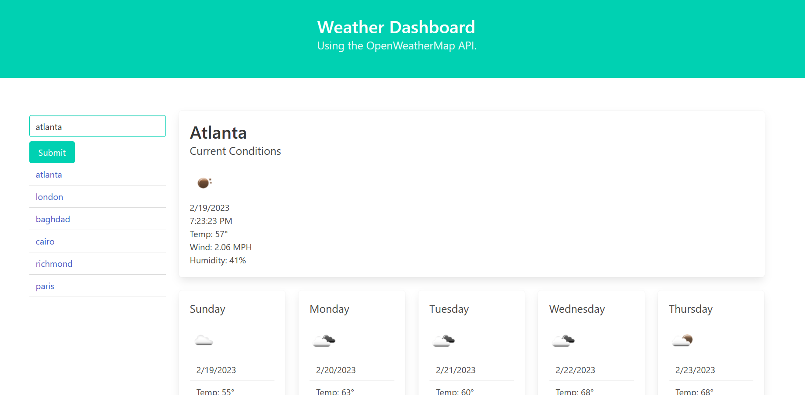

# Weather Dashboard (Open Weather Map API)

  

  ## Description

  Showcases use of the Open Weather API, localStorage, the bulma framework and jQuery - allows user to search for weather conditions and a five-day forecast by city name.

  ## Table of Contents

  - [Usage](#usage)
  - [Credits](#credits)
  - [License](#license)
  - [Questions](#questions)

  ## Usage

  Enter a city name in the form and press enter or the submit button, or click on one of the links in the search history to return current weather and a forecast.

  

  ## Credits

  Thank you to the OpenWeather API and Bulma framework!

  ## License
    
    This project is licensed under the MIT license.

  ## Questions

  - [GitHub User: Kurtmj93](https://github.com/Kurtmj93/)
  - Email: Kurtmj93@gmail.com

